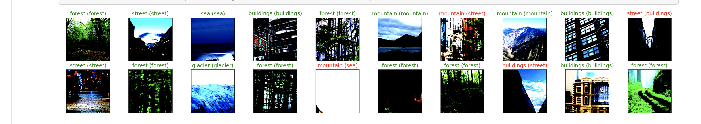

# Intel-Image-Classification

## Overview 
Welcome to the Intel_Image Classification Project! This project uses Transfer Learning from a pretrained VGG16 model to
classify the landmark represented in a certain image. The model is a Convolutional Neural Network (CNN).

A sample of the output is:

## Getting started
1. Checking Dependencies 
2. Add them to environment 
3. Git cloning the project in the right directory 

### Dependencies
Create a new environment using Anaconda. If you don't have anaconda installed check the [Installation Documentation](https://docs.anaconda.com/anaconda/install/)

To create a new environment type the following in terminal: 

`% conda create -n [environment name] python=3 [other dependencies]`

### Adding to environment
In the environment `% conda install` all the packages. My environment was specified in the [requirements](requirements.txt)

**Important Packages**
* pandas
* numpy
* pytorch
* matplotlib

### Cloning
First initialize a git file with `git init`

Finally, Use `git clone` to clone the project. 

## Getting Data
This uses a kaggle dataset. To access the dataset and download it please go [here!](https://www.kaggle.com/puneet6060/intel-image-classification)

## Other Options

### Using GPU 
You can use GPU to speed up training. It is recommended that you do use or else the training time will be very long. 

